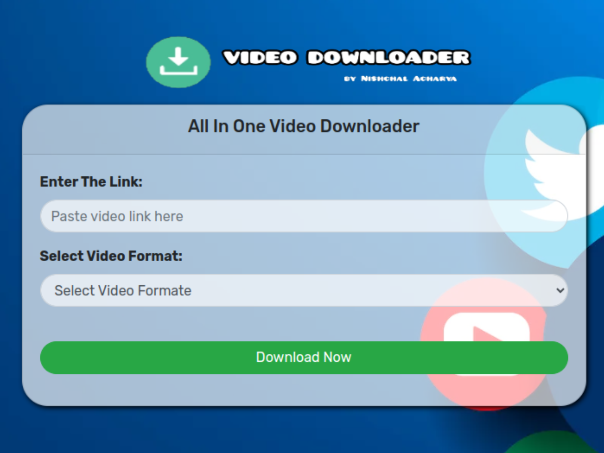

# Video Downloader

  

Hey there! Welcome to the Video Downloader project repository. This awesome site lets you download videos from any platform. Just paste the link of the video you want to download, select the resolution from the dropdown menu, and voila! You're all set to enjoy your favorite videos offline.

## DEMO

 <!-- Replace with your actual demo image -->

Curious to see how it works? Check out the live demo [here](#). (Don't worry, it's coming soon!)

## How to Use

1. **Paste the Video URL**: Copy the URL of the video you want to download from any platform.
2. **Select Resolution**: Choose the resolution of the video you want to download from the dropdown menu.
3. **Download**: Click on the download button and let the magic happen!

## Contact

Got any questions, feedback, or just want to say hi? Feel free to reach out to me at nismsg1@gmail.com.

## Developer Info

| Name           | Email                     | Portfolio                                      | 
| -------------- | ------------------------- | ---------------------------------------------- | 
| Nishchal Acharya | nismsg1@gmail.com        | [Nishchal Acharya Portfolio](https://nishchalacharya.com.np) |

Let's make the world a better place, one download at a time! 🚀
